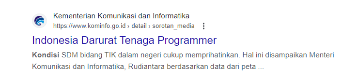
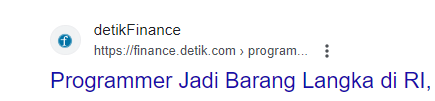

### "Learning programming is most effective through hands-on experience. No matter how many books you read, YouTube videos you watch, courses you take, or fancy university you attend, if you're `NOT` writing code - it's useless." - M.A.R

