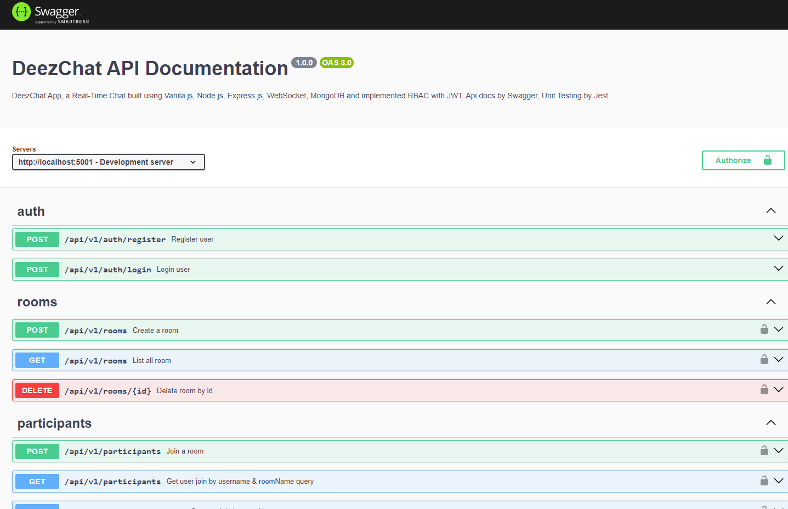

<h1 align="center">Fancy to see you here  </h1>

hi, I'm Muhammad Avicena. In this repo, I build a Real Time Chat application implemented role-based access using Vanila.js, Node.js, Express.js, Socket.io, MongoDB, Jest and Swagger. It's designed to interact with each other like group chat. If you have any question or feedback, hit me up at anytime !

I am committed to staying up-to-date with industry trends and using the latest tools to develop innovative solutions that surpass expectations.
Interested to have collaboration ? Find me on:

[](https://www.linkedin.com/in/muhammad-avicena/)
[](https://www.youtube.com/@MuhammadAvicena)
[](https://www.instagram.com/ryuhideaki.dev/)
[](mailto:cenarahmant.dev@gmail.com)

## INGREDIENTS I USE 📜

- WebClient
  - Vanila JS
  - Tailwind CSS
- WebServer
  - Node.js
  - Express.js
  - JWT for Role-Based Access Controll
  - WebSocket/Socket.io for Real Time Connection
  - MongoDB
- Unit Testing
  - Jest
- API Documentation
  - Swagger UI

## ARCHITECTURE 🌟


## HOW TO SET UP 📰

You will need a github account to clone this repository, make sure you're connected to github.

```bash
# Clone this repository or simply fork it.

- git clone https://github.com/muhammad-avicena/deez-chat-app.git

# Install depedencies

- npm install

# Set up the .env file, follow the template from `.env.example`.

  # PORT
  PORT=5001

  ## Database connection
  DB_PROD=
  DB_DEV=
  DB_NAME=

  ## JWT Sign
  JWT_SIGN=

# Run the application

- npm run start
- npm run dev
```

## AVAILABLE API 📰

**Endpoint :** [https://deezchat.avicena.dev](https://deezchat.avicena.dev)

| Name                          | HTTP Method | Endpoint                                                                                              | Requirements                                              |
| ----------------------------- | ----------- | ----------------------------------------------------------------------------------------------------- | --------------------------------------------------------- |
| **Login User**                | `POST`      | [/api/v1/auth/login](https://deezchat.avicena.dev/api-docs)                                           | Request Body: `username: string, password: string`        |
| **Register User**             | `POST`      | [/api/v1/auth/register](https://deezchat.avicena.dev/api-docs)                                        | Request Body: `username: string, password: string, gender: string`        |
| **List All User**             | `GET`       | [/api/v1/users](https://deezchat.avicena.dev/api-docs)                                                |
| **List User by ID**           | `GET`       | [/api/v1/users/:id](https://deezchat.avicena.dev/api-docs)                                            | Request Params: `id: number`                              |
| **Update User role**          | `PATCH`     | [/api/v1/users/role/:id](https://deezchat.avicena.dev/api-docs)                                       | Request Params: `id: number` Request Body: `role: string` |
| **List All Rooms**            | `GET`       | [/api/v1/rooms](https://deezchat.avicena.dev/api-docs)                                                |                                                           |
| **Create a room**             | `POST`      | [/api/v1/rooms](https://deezchat.avicena.dev/api-docs)                                                | Request Body: `roomName: string, username: string`        |
| **Delete Room by ID**         | `DELETE`    | [/api/v1/rooms/:id](https://deezchat.avicena.dev/api-docs)                                            | Request Params: `id: number`                              |
| **User Join**                 | `POST`      | [/api/v1/participants](https://deezchat.avicena.dev/api-docs)                                         | Request Body: `roomName: string, username: string`        |
| **Get User Join**             | `GET`       | [/api/v1/participants?roomName={roomName}&username={username}](https://deezchat.avicena.dev/api-docs) | Request Query: `roomName: string, username: string`       |
| **Get User Join by RoomName** | `GET`       | [/api/v1/participants/list?roomName={roomName}](https://deezchat.avicena.dev/api-docs)                | Request Query: `roomName: string`                         |
| **User Leave**                | `DELETE`    | [/api/v1/participants](https://deezchat.avicena.dev/api-docs)                                         | Request Body: `username: string`                          |

## Swagger UI - API Documentation and Testing ⚡

**Detail documentation will be shown here :** [https://deezchat.avicena.dev/api-docs](https://deezchat.avicena.dev/api-docs)


## DEPLOYMENT ⚙️


The project has been successfully deployed using Railway. You can access the production version of the website by following this link: [https://deezchat.avicena.dev](https://deezchat.avicena.dev).

Feel free to explore the website and try out the different features. I appreciate any feedback and suggestions to further improve the user experience.
